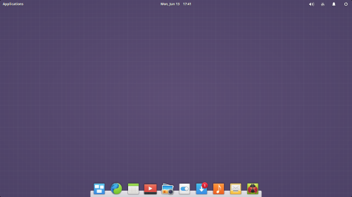

# elementary OS devbook

Welcome to an unofficial guide to help you develop your application for `elementary OS`. This guide is **NOT** meant to teach how to program in the `Vala` programming language nor is it meant to teach you `GTK+` GUI programming. All you will learn is how to use your existing knowledge in Vala and GTK+ to follow this guide to be able to design and build your application for [elementary OS](elementary.io).

Note that the language and information here are my own opinion, and I do not represent any organization or `elementary LLC.` in anyway.

> #### Side Notes
> * **Vala** is a computer programming language used mostly to develop GTK+ applications. It is also used to write libraries and APIs.
> * **GTK+** is a toolkit for developing Graphical User Interface (GUI) applications. With GTK+, you can develop applications that has buttons, text inputs, labels, switches, images, menu, etc. 
> * You can learn Vala from the [Gnome Website Tutorial](https://developer.gnome.org/gnome-devel-demos/stable/beginner.vala.html.en) and GTK+ by visiting the [Gnome Vala Wiki](https://wiki.gnome.org/Projects/Vala/Tutorial) or [Horace Abenga's website](http://www.abenga.com/postseries/introduction-to-gtk+-programming-using-vala/)

## Contents
* [Chapter One: Introduction to Tools and Resources](chapter_01.md)
    - [x] Development tools and resources
    - [x] Learning resources
    - [ ] Setting up your development environment

*  Chapter Two: Designing Your Application (UI and UX)
    - [ ] Brainstorming :)
    - [ ] Wireframing your (UI, UX flow chart)
    - [ ] Mocking up a prototype.
    - [ ] Finalizing your designs

*  Chapter Three: Coding Your Application (Tutorials)
    * Creating and structuring your project
    * Diving into Vala and GTK+
    * Using the Granite framework
    * Developing sample applications
*  Chapter Four: Getting Your Application Ready for the Real World
    * Creating and using a repository (Github, Launchpad)
    * Setting up a build and packaging system
    * Creating setting-up website for your application
    * Future updates and improvements
    * Conclusion
