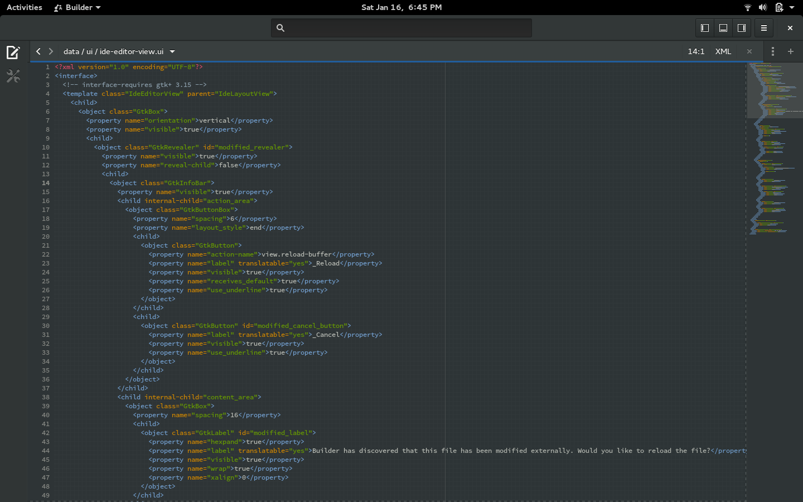

# Chapter One: Introduction to Tools and Resources

```
* Development tools and resources
* Learning resources
* Setting up your development environment
```

Developing apps for elementary OS is not much different from developing GTK+ applications for other Linux distributions, especially debian based distributions. The major differences have to do with the few set of elementary OS specific APIs which you could (should) utilize when targeting elementary OS.

In this chapter, we will take a look at some tools and resources available to developers. Note that this guide will in some cases reference resources for you to check out on your own. All these resources are already in existence and this guide just point you to some of them. Beware that I **DO NOT** take responsibility of their factuality or continuous availability. However, I could make changes to this guide as situations change.

## 1.1 Development tools and resources

Tools and resources presented here are those you **MAY** need when developing (designing, coding, documenting, building, packaging, etc.) your application.

The most obvious tools are the `vala compiler` with package name `valac` in the software repository, a copy of elementary OS installed, and a text editor or an Integrated Development Environment (IDE). 

### 1.1.1 Choosing a text editor (code editor) or an IDE

There are many text editors and IDEs available for vala application development, but those I have used and trusted include;

* [Scratch Text Editor](http://elementary.io): It is the default text editor pre-installed in elementary OS. It has vala code syntax highlighting and basic auto-completion by default. 

* [Sublime Text](http://sublimetext.com): A fast and lightweight text editor with smart intellisense that make coding less tedious. It has vala code syntax highlighting support through the `Vala-TMBundle` package found in sublime text editor [package control](https://packagecontrol.io/). 

* [Atom Text Editor](http://atom.io): Similar in functionality compared to sublime text but has an improved UI: feature packed with an easy-to-use point-and-click package manager (displayed with `Ctrl + ,`), well supported with a lot of packages. It has vala support through the `language-vala` and `Valhalla` packages. The `terminal-plus` package also provide you with a terminal within the editor which saves you time from switching back and forth between your text editor and the terminal application. The Downside is that it can be slow on low-end computer because it built with HTML, CSS and JavaScript. 

* [Gnome Builder](https://wiki.gnome.org/Apps/Builder): An IDE designed for developing Gnome Software with good vala support by default including code syntax highlighting, build system integration, good auto-completion, and `devhelp` integration. 

### 1.1.2 Source Code Management Systems and other tools.

There are many resources available for managing your application source code. Those provided here are the commonly used by developers.

#### Source Code Version Control Systems (DVCS/VCS)

* [Launchpad](https://launchpad.net): A free online service for hosting code online, collaborative development and many more. It is used officially for developing elementary OS and its applications.

* [Bazaar](http://bazaar.canonical.com): A distributed version control system for interacting with launchpad.

* [Git](http://git-scm.com): a source code management system which you can use to manage your code during development and other version control tasks. It is similar to bazaar mentioned above, so you can either one of them.

* [GitHub](https://github.com) is a web-based Git repository hosting service. It offers all of the distributed revision control and source code management (SCM) functionality of Git as well as adding its own features. It offers several functionality to assist project collaboration.

#### Other tools

##### Design tools (wireframing, mock-up, icons)

* [Inkscape](inkscape.org): A libre vector drawing software commonly use by the elementary community for designing. It can be use for wireframing, mocking-up prototypes and icon designs.

* [Gimp](gimp.net): Another libre bitmap image editing software used for photo manipulation. While making your designs, you can use gimp to resize, crop, and apply filters on your images.

* **Sketch book and pencil**: You may need these for the initial sketching of your design concept and flow chart. Depending on how complex the your application will be and the number of people working on the project, you may even need to use other tools for collaborative development.

#### More tools

* [GNU debugger](https://www.gnu.org/software/gdb/): a tools for [debugging](https://en.wikipedia.org/wiki/Debugger) your code. There is a YouTube video on this tool [here](https://www.youtube.com/watch?v=7vTCR4_m48s).

* [Transifex](https://www.transifex.com): An online resource for collaborative translation of software into other languages.

* [GTranlator](https://wiki.gnome.org/Apps/Gtranslator) or [Poedit](https://poedit.net): Tools designed for translating software into different languages using language string template files (.pot, .po, etc.).

* [cmake](http://www.cmake.org): a cross-platform build system used officially in all elementary OS applications. We will use a version of cmake modules managed by the elementary apps team. Use `bzr branch lp:~elementary-os/+junk/cmake-modules` to grab a copy onto you local computer.

* [Debian packaging system](https://wiki.debian.org/Packaging): A packaging system used for generating `.deb` packages of your application.

### 1.1.3 Development libraries

The [official development libraries](http://elementary.io/developer) include the `Granite`, `Contractor`, `GDA` and `Soup`. 

Several other libraries are available for use depending on the feature you want to to implement in your application (Networking, Video and Audio processing, etc.). A list of available APIs along with their documentation can be found at [valadoc.org](http://valadoc.org)

## 1.2 Learning resources

Learning resources are those resources available to you for learning how you can use the various development tools and resources to develop your application. Not all the resources provided here were intended for elementary OS application development and you may have to do transfer of knowledge in some cases.

### 1.2.1 Documentations

Since this guide assumes that you already know (at least basic) GTK+ and vala, those documented resources provided here are geared towards elementary OS application development.

* The **Developers section of elementary OS website**: This is the first resources to check out if you want to develop for elementary OS. It has a [Getting Started Tutorial](https://elementary.io/docs/code/getting-started), the official [Human Interface Guidelines](https://elementary.io/docs/human-interface-guidelines), and a [Reference Material](https://elementary.io/docs/code/reference). Make sure you have **REALLY** gone through all those materials before you even consider reading any further in this book or using any other learning resource. You may need to read over and over again to make sure you familiarise yourself with elementary OS application development work-flow.
* [Valadoc](http://valadoc.org): A great documentation resource for elementary OS development libraries, as well as, other libraries available for developing vala applications. It has documentation for almost all the libraries you would ever need when developing your application. Valadoc is available as an online tool but can be clone from [Github](https://github.com/flobrosch/valadoc-org) and hosted locally on your computer.
* **Applications Source Code**: A great way to learn something is by learning from those who already know how to do it. By browsing through the source code of vala applications built for elementary OS, especially official applications, you learn a lot from their respective developers. Official application projects are hosted in Launchpad can be found [here](https://launchpad.net/elementary). With Bazaar installed (`sudo apt install bzr`), you can branch/clone an application in Launchpad by entering `bzr branch lp:APP_ID` in your terminal, where `APP_ID` is the application ID. For example, entering `bzr branch lp:noise` will clone the official music application called **_Noise_**.

### 1.2.2 Tutorials

#### Written tutorials

These are unofficial tutorials by third-parties;

* [eos.doodlespark.ca](http://eos.doodlespark.ca) provides a work-in-progress developer guide on the Granite framework accompanied with demo code and detailed explanation. It also has an [Icon Guide](http://eos.doodlespark.ca/?p=icon-guide) for GTK+ icon names along with their `elementary theme` icons, grouped according to their respective categories.
* [Christopher Timberlake's tumblr blog](http://game64.tumblr.com) has a blog post titled **_So you want to develop for elementary OS?_** which takes you through the process of creating a demo Granite application with a `cmake` build system with detailed step by step explanation.

#### Video tutorials

Coming soon ;)

(Actually am still searching for some. You can submit any tutorial you come across on YouTube, etc.)

## 1.3 Setting up your development environment

This section will help you set up the necessary tools and resources to get your computer ready for development. The elementary OS project has set up a [Getting Stated Tutorial](https://elementary.io/docs/code/getting-started) tutorial which includes a section for setting up your development environment. By following that guide, you should be able to install all dependencies such as cmake, Granite, Bazaar, GTK+, etc, as well as, create a Launchpad account. These are the basic setup required for development.

### Using a third-party text editor

The default text editor that is pre-installed in elementary OS, Scratch, is good for basic code editing but I recommend _Sublime_ or _Atom_ text editor for better coding experience. Below is how you can set up either one those text editors.

#### Installing and configuring Sublime text editor

Download and install Sublime Text Editor (Version 3) from <http://sublimetext.com>. Since Sublime does not come with vala syntax highlighting by default, you may have to install the `Vala-TMBundle` package. You can install this package by downloading it and installing manually or using the Sublime Package Control within the text editor. Using the Sublime Package Control approach is what I recommend to be able to make future package updates and installations right from Sublime.

##### Configuring and installing from the Package Control

To install using the package manager make sure you have Internet connection since the packages will be fetched from the package control from a remote server.

* Go to <http://pakagelink.com>, copy the piece of code from the ....[FIX THIS],
* Open Sublime on your computer and paste the code in the Console entry box displayed by pressing `Ctrl + [back-tick]` on your keyboard or `View > Show Console` from the menu.
* Press `Enter` and wait for the script to configure the package control. After successful configuration, Sublime is now be ready to install the `Vala-TMBundle` package as well as any other package in the future right from the text editor.
* You can now display the Package Control by pressing `Ctrl + Shift + P` or `Preferences > Package Control`. Using the Up or Down key on your keyboard, navigate to `Install Package` and press Enter. Wait for Package Control to fetch the list of packages from the remote server (this may take some few seconds depending on your Internet connection speed). When all the packages are fetched, you will see the list of packages in the Package Control dialog displayed at the upper middle corner in the Sublime.
* Search for `Vala-TMBundle` using the search entry within the dialog, navigate to the Vala-TMBundle package, press Enter to install it. You are now ready to start coding with sublime :)

##### Installing packages manually in Sublime

To install `Vala-TMBundle` manually, go to the Github repository of the package at <https://github.com>[FIX THIS LINK] and download the package source by clicking on green `Clone` button and then the `Download Package zip`[FIX THIS] link. Open Sublime and click on `Preferences > Browse Packages` from the main menu. This will open the location where Sublime packages are installed in your file manager. Unzip the `Vala-TMBundle` archive and copy the unzipped copy (the whole folder) into `User` directory within the package install location. Restart sublime and you are ready to go :)

#### Installing and configuring Atom text editor

Installing packages in Atom Text Editors is much easy and straight forward compared to Sublime. Whilst making sure you have Internet connection;

* Download and install Atom form their website at <https://atom.io>
* Open Atom and display the package manager clicking on `Packages > Settings View > Install Packages/Themes` from the main menu.
* Wait for Atom to fetch for the list for available packages and search for `language-vala` and `Valhalla` and install both. You may also want to install the `terminal-plus` package to get a terminal within Atom. You are now ready to start coding with Atom.

### Using valadoc documentation offline

Using valadoc.org requires that you have persistent Internet connection. However, there are two ways you can use the valadoc offline: (1) running valadoc on a local server on your computer or (2) downloading compressed HTML documentation files for each individual library you would like to use.

To use run a local server for valadoc visit their [Github repository](https://github.com/flobrosch/valadoc-org) where they have instructions on how to do that. To download compressed html documentation files, visit valadoc.org and scroll down to the your library of choice and click on the `Download documentation`[FIX ME] to download a compressed copy of the documentation of that library. You can now extract the contents of the downloaded file which contains the HTML documentation files.

> ### Tip to convert any web page to PDF

> Saving web pages as HTML files could make your directories cluttered. You could instead save any web page as PDF right from you browser by pressing `Ctrl + P` as if you are printing the page and then click on `Print to File` from the print dialog. Choose where you want to save the file as PDF and click print to save.
