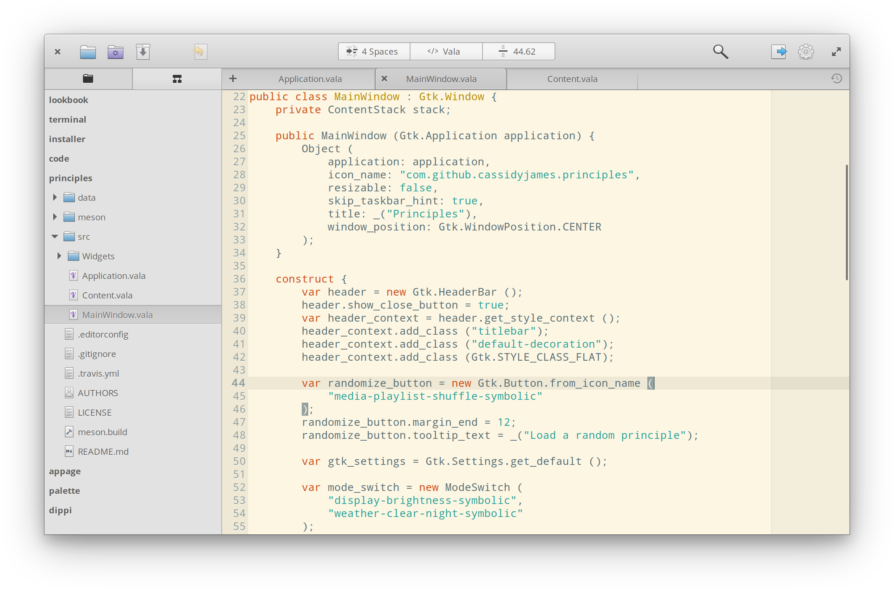

# Chapter One: Introduction to Tools and Resources
    * Development tools and resources
    * Learning resources
    * Setting up your development environment

Developing apps for elementary OS is not much different from developing Gtk applications  for other Linux distributions, especially debian based  distributions. The major differences have to do with the few set of elementary OS specific APIs which you could (should) utilize when targeting elementary OS.

In this chapter, we will take a look at some tools and resources available to developers. Note that this guide will in some cases reference resources for you to check-out on your own. All these resources are already in existences and this guide just point you to them as I come across any during research. Beware that I do **NOT** take responsibility to ensure those resources are always available to you. However, I could make changes to this guide as situations change.

## Development tools and resources
Tools and resources presented here are those you **MAY** need when developing (coding, documenting, building, packaging, etc.) your application.

The most obvious tool is the `vala compiler` with package name `valac` in the software repository, a copy of elementary OS installed, and a code editor or an IDE.

### Choosing a code text editor (code edit)
There are many text editors and IDEs available for vala application development, but those I have used and trusted include;

* Scratch Text Editor: It is the default text editor pre-installed in elementary OS. It has vala code highlighting by default and basic auto-completion.

* [Sublime Text](sublimetext.com): A fast and lightweight text editor with code intellisense that make coding less tedious. It has vala code highlighting support through the `Vala-TMBundle` plug-in found in sublime text editor [package control](sublimetext.com).

* [Atom Text Editor](atom.io): Similar in functionality compared to sublime text but has an improved UI: feature packed with an easy-to-use point-and-click package management system, well supported with a lot of packages. It has vala support through the `language-vala` and `Valhalla` packages/plug-ins. Downside is that it can be slow on low-end computer because it built with HTML, CSS and JavaScript.

* [Gnome Builder](gnome.org): An IDE designed for developing Gnome Software with good vala support by default including code highlighting, build support good auto-completion, and devhelp integration.

### Source code (Distributed) Version Control Systems (DVCS/VCS).
There are many Source code Version Control Systems available for management your application source code. Some of the most commonly used ones include;

* Bazaar: a sub-version software of interacting with launchpad
* Git: another source control system
* GNU debugger: a tools for [debugging](wikipedia.org) your code

### Development APIs and libraries
The official development APIs/libraries include the `Granite`, `Contractor API`, `GDA` and `Soup`.

Several other libraries are available for use depending on the feature you want to to implement in your application (Networking, Video and Audio processing, etc.). A list of available APIs along with their documentation can be found at [valadoc.org](valadoc.org).

Tools available for designing (wireframing, mock-up, icons) include;

* [Inkscape](inkscape.org): A libre vector drawing software commonly use by the elementary community for designing. It can be use for wireframing, mocking-up prototypes and icon designs.

* [Gimp](gimp.net): Another libre bitmap image editing software used for photo manipulation. While making your designs, you can use gimp to resize, crop, and apply filters on you images.

Others tools you may need include a sketch book for initial sketching of your designs and flow chart.

### Other tools

Tool Name | Description | Website
----- | ----- | -----
cmake | -
debian packaging | - | -
GTranlator / Poedit | - | -

## Learning resources
Learning resources are those resources available to you for learning how you can use the various development tools and resources to develop your application. Not all the resources provided are intended for elementary OS application developers and you may have to do transfer of knowledge in some cases.  

    * valadoc
    * devhelp
    * launchpad code
    * Github code
    * developer.gnome.org tutorials
    * YouTube videos
    * Abenga's website

### Beginners
The are those providing by for ...
