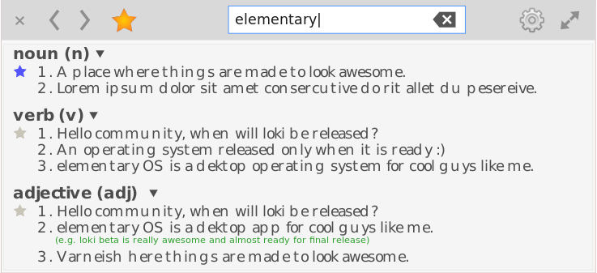

# Chapter Two: Designing Your Application (UI and UX)

```
* Brainstorming
* Wireframing
* Creating mock-ups, drawing icons, and prototyping.
* Finalizing your designs
```

In this chapter, we will take a look at how you can plan for an application, wireframing, creating mock-ups using [Inkscape](http://inkscape.org), and polishing designs for development. We will also take a look at how to do icon design to fit in the elementary OS design principles. Usually, it is tempting to skip this process and go on to code your application. However, planing-out your application before beginning to write code will save you a lot of time and will help you structure your code and architecture to give a better user and developer experience.

## Brainstorming

The first step in design an application involves some kind of brainstorming on the kind of application you want to build, the problem your application will solve, the target users, features needed in the application, etc. It is important that you plan for these things since there are several approaches a developer can take to develop an application. No single application can meet the requirements of all users so it is important that you choose a target group. Knowing your target group will help determine the features you would need to implement in your application.

A common saying by the elementary OS team is to build something that does one specific thing and does it very well. Remember that there is no need to build an application which has already been built. You could instead contribute to making and existing application better.

A handy approach for brainstorming is to sketch out the various concepts and ideas that come in mind using pencil and paper. You may also choose to sketch digitally on your tablet or touch screen enable computer, but I think using pencil and paper is quicker, as well as, less destructive. The pencil and paper gets you focused on the idea without worrying about pixel perfection. It is also importance to keep the `Human Interface Guidelines` at the back of your mind. The design of the official elementary OS applications may serve a guide when brainstorming.
[Sketches here]

## Wireframing

Wireframing comes after you have settled on a design concept for your application. Wireframes are basically pixel perfect versions of final sketches and it is used to document an application. They are static and non-interactive, each representing a specific state of the application at a point in time. It showcases the layout and UI elements, the various states of an application, as well as, the user experience. Since each wireframe is static and non-interactive, it is usually accompanied by short notes explaining the state of that particular wireframe. A wireframe is a quick way to get feedback (designer) and insights into how the application will work and the various UI elements which will be used in development (developer).

[Image of sample wireframe here FIX THIS]()

You can create wireframes using the vector drawing program, _Inkscape_, available in the _AppCenter_. Colours such as grey, white, and black are usually used when wireframing to render designs simple and apparent. Links may also be coloured in blue <sup>\*</sup>. A wireframe is simple and quick to draw (since you already have the concept layed out in your sketches during brainstorming) but very effective at getting you focused during the actual development stage, as well as, communication within a team.

> \*\* You may use drop-shadows and gradients to make the UI elements in a wireframe stand-out — makes the state of the application wireframe more apparent.

## Creating mock-ups, drawing icons, and prototyping.

### Creating mock-ups

A mock-up is a drawing that serve as a visual representation of an application in it's complete state. A well designed mock-up visually appear like the final product and you may even be tempted to click :smile:. Creating a mock-up can be time-consuming and requires good illustration skills to be able to draw "the real thing".


Mock-up of Dictopia, a sample application built in Chapter Three.

Creating good mock-ups requires familiarizing yourself with the various GTK+ and Granite widgets, the [Official Brand](https:elementary.io/brand), and the [Human Interface Guidelines](https://elementary.io/docs/human-interface-guidelines). These will guide you to create a design that visually fits well in the ecosystem of applications designed for elementary OS. Mocking-up your application might be time consuming but not as much as the time it takes to write the actual code, only to realize you need to change the design.

### Drawing icons

The elementary OS Human Interface Guidelines has a section designated for [Iconography](https://elementary.io/docs/human-interface-guidelines#iconography). It provides a detailed guide on how you can design icons that fit nicely in the elementary OS ecosystem. The icons for the official elementary OS applications are hosted in their [elementary GitHub repository](https://github.com/elementary/mockups).

### Prototyping

Prototyping is a process of simulation the interaction and user experience of your final application to give an impression of how an application will work. A prototype is an abstraction that accepts user actions and provide a simulated response — a fake response just like how the final application will work.

Prototyping is not required but can save you time because you are able to see which concept will practically provide a better user experience, easy to implement and worthy of putting effort into it.

There are several prototyping tools to choose from depending on your requirements <sup>#</sup>.

> \# Javier Cuello has a blog post titled "[Choosing The Right Prototyping Tool](https://www.smashingmagazine.com/2016/09/choosing-the-right-prototyping-tool/)" on Smashing Magazine which provides a general insights into the various prototyping tools. Currently, there seem to be no native prototyping application for elementary OS, except for web applications. (let me know if you find any).

## Finalizing your designs

...
