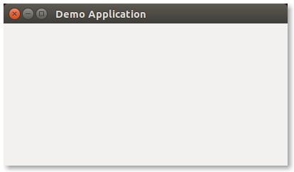

# Chapter Three: Coding Your Application (Tutorials)

```
* Creating and structuring a project
* Diving into Vala and GTK+
* Using the Granite extension
* Using the cmake build system
* Developing sample applications
```

In this chapter, we will take a look at how create and structure a project for a new elementary OS application. We will also dive into some Vala and GTK+ demonstrations to learn the process involved in development. Moreover, we will take advantage of the Granite extension which provides some well designed re-usable widgets and APIs which makes developing applications quick and easy. Finally, we will use the [cmake build system](http://www.cmake.org/) to build and install the demonstrated application (along with icons and configuration files) for testing in your development environment.

After learning all those above, you will then learn to use those acquired skills to build sample applications. This will demonstrate some real-world elementary OS application development challenges and how to get around them. In the course of learning, you will be introduced to Object Oriented Programming patterns, some Vala tips and tricks among others.

## Creating and structuring an application project
An project is combination of source files, configuration files and graphics, structured logically to make development manageable and easy. You may create your project in any directory (folder) you want, but I usually place mine at `workspace/vala/` in my Home directory. Whilst in the `workspace/vala/` directory, create a director named `demo-app` which will serve as the project's root directory. The basic structure of project is as below;

```sh
demo-app/
        src/
            Application.vala    
```

As you can see, the `demo-app` directory being the project root has a sub-directory, `src`, which contains a single file named `main.vala`. Inside the `src` directory is where all Vala source files will be placed. This is the most basic structure project could have. We will add more directories to the project root as we expand our basic application. The `main.vala` file will contain the initial code of the application which will server as entry point.

Now that we have the project structure set-up, it is time to install the _development libraries_ as provided in the official elementary OS [Getting Stated Tutorial](https://elementary.io/docs/code/getting-started#development-libraries). 

You can install the development libraries in your terminal using `sudo apt build-dep granite-demo`. As indicated in [Chapter One](chapter_01.md), there a several development tools available for development. I will be working on elementary OS 0.4, Loki, using Scratch (the default text editor) and Terminal —  all are pre-installed.

## Diving into Vala and GTK+

### A basic GTK+ demo
Now that we have the basic required setup, it is time to write some Vala and GTK+ code. Open the `demo-app` project in Scratch, and write the following basic vala code in `main.vala` <sup>*</sup>.

```vala
int main (string[] args) {
    stdout.printf ("Hello, World!\n");
    return 0;
}
```

The code above is a simple vala program made up of `int main()`, the main loop, which contains `stdout.printf ("Hello, World!\n");` which prints the string `Hello, World` to the screen and returns `0` - `0` informs the  Operating System of a successful execution without any errors. 

To compile this program, navigate to `~/workspace/vala/demo-app` in Terminal and enter the command `valac src/main.vala` which compile the program using the Vala compiler. You can now test the program using the command `./main` <sup>#</sup>.

> \* The coding convention used in this guide is based on the [elementary OS  reference guide](https://elementary.io/docs/code/reference).

> \# As I indicated earlier in the [introduction](README.md), the guide is not meant to teach you Vala and GTK+ programming. It is assumed you already have a basic knowledge and understanding of the above. We will be making more use of the command-line henceforth to compile our programs as we continue to add more functionality. When your encounter and error when compiling or running the program, please double check to make sure you type everything correctly.
 
Now that we have been able to compile and run a basic Vala program, we are now ready to write some GTK+ code which will launch a window. Again open the `main.vala` file and enter the following code;

```vala
int main (string[] args) {
    Gtk.init (ref args);

    var window = new Gtk.Window ();
    window.title = "Demo Application";
    window.window_position = Gtk.WindowPosition.CENTER;
    window.set_default_size (400, 200);
    window.destroy.connect (Gtk.main_quit);
    window.show_all (); // Show window and all child widgets to the screen
 
    Gtk.main (); // Runs the GTK+ main event loop
    return 0;
}
```

The code above initializes GTK+ using `Gtk.init ();`, which accept the command line argument `args` as a `ref` parameter (see GTK+ reference at valadoc.org for detailed explanation of `Gtk.init ()`). We then create a GTK+ window, set the window title, the window position on the screen, and it's default width and height. We then register the `Gtk.main ()` method (function) to be executed when the user clicks the close button of the window.

To compile this program, we have to pass the GTK+ package (`gtk+-3.0`), as a command-line argument since we are now using GTK+ GUI toolkit in the code. You can now run the app using `./main` as usual.



## Using the Granite extension

### Using Granite `Application` class
Using `Gtk.init ()` and `Gtk.main ()` to initialize and run a GTK+ application works all right, but the `Granite.Application` class (as subclass of Gtk.Application) offers a more convenient option. According to the GTK+ documentation;

>_"Currently, GtkApplication handles GTK+ initialization, application uniqueness, session management, provides some basic scriptability and desktop shell integration by exporting actions and menus and manages a list of toplevel windows whose life-cycle is automatically tied to the life-cycle of your application"_. See the GTK+ reference for further details.

The Granite.Application class is the base class of all Granite-based applications and it adds more functionality on-top of Gtk.Application. `Granite.Application` is customised for elementary OS application development so it is _highly_ recommended to use it instead of `Gtk.Application.

To make the use of `Granite.Application` more practical, we will be creating a basic dictionary application called `Dictopia`. Building Dictopia will provide a real-world development experience. The wireframe and mock-up of Dictopia was already demonstrated in Chapter Two, so we will go ahead to the coding part. We could put all the code in the `main.vala` file, but it is much convenient to write it in a  separate file. This style of coding introduces [Object Oriented Programming]()[FIX LINK] and is in-line with the elementary OS reference guide. Create a new file named `Application.vala` in the `src` directory. The contents of the file is prefixed with the [GPL legal header](https://elementary.io/docs/code/reference#gpl-header) <sup>^</sup>;

```txt
/* 
* Copyright (c) 2011-2016 Lawrence Aberba (https://github.com/laberba/)
*
* This program is free software; you can redistribute it and/or
* modify it under the terms of the GNU General Public
* License as published by the Free Software Foundation; either
* version 2 of the License, or (at your option) any later version.
*
* This program is distributed in the hope that it will be useful,
* but WITHOUT ANY WARRANTY; without even the implied warranty of
* MERCHANTABILITY or FITNESS FOR A PARTICULAR PURPOSE.  See the GNU
* General Public License for more details.
*
* You should have received a copy of the GNU General Public
* License along with this program; if not, write to the
* Free Software Foundation, Inc., 59 Temple Place - Suite 330,
* Boston, MA 02111-1307, USA.
*
* Authored by: Lawrence Aberba <karabutaworld@gmail.com>
*/
```

This declares that this code is backed by the GPL license. Make sure you replace the name, email address and website URL with your own.

> ^ Usually, a source code has a legal backing which states the author and the legal restrictions placed on the usage of the source code. There are several [licensing options]()[FIX LINK] available and you are free to choose any for your code. I however, will use the [GPL license](http://www.gnu.org/licenses/) for all source code in this guide.

After the license, you can then add the following code;

```vala
namespace Dictopia {

    class Application: Granite.Application {
        
        construct {
            /*
                You may also use;
                    ApplicationFlags.HANDLES_OPEN
                    ApplicationFlags.HANDLES_COMMAND_LINE;
            */
            flags |= ApplicationFlags.FLAGS_NONE;

            application_id      = "com.aberba.dictopia";
            program_name        = "Dictopia";
            exec_name           = "dictopia";

            build_version       = "0.1"; 
            app_years           = "2016";
            app_icon            = "application-default-icon"; //use the default fallback
            app_launcher        = ""; // we will set this later

            main_url            = "";
            bug_url             = "";
            help_url            = "";
            translate_url       = "";

            about_authors       = {"Lawrence Aberba <karabutaworld@gmail.com>"};
            about_documenters   = {"Lawrence Aberba <karabutaworld@gmail.com>"};
            about_artists       = {"Lawrence Aberba <karabutaworld@gmail.com>"};
            about_comments      = "A simple dictionary application";
            about_translators   = "translator-credits";
            about_license_type  = Gtk.License.GPL_3_0;
        }

        public override void activate () {
            var window = new Gtk.ApplicationWindow (this);
            window.title = "Demo Application";
            window.window_position = Gtk.WindowPosition.CENTER;
            window.set_default_size (400, 200);
            
            window.show_all ();
        }
    }
}
```

In the above code we make use of some Object Oriented Programming features of Vala including classes and the [namespace]()[FIX LINK] construct to scope blocks of code. The Dictopia code is exposed with the `Dictopia` namespace within which all code are encapsulated.

The `Dictopia.Application` class uses the GObject-Style construction as opposed to the Java or C# style of construction — Vala supports both. Within the `construct` constructor block we initialize the _so-called_ construct properties of `Granite.Application` such as application_id, program_name, build_version, etc., as well as, other customizations: application and developers information (see Granite documentation on [valadoc.org](http://valadoc.org)). In the `flags |= ApplicationFlags.FLAGS_NONE;` code, we append the flag using `|=` without setting it as the only argument to `flags`. The `Granite.Application` requires that you set the `application_id` property. A traditional way is to do com/net/org (dot) your companies name (dot) your application name (all in lower-case). In my case, I chose to use `com.aberba.dictopia` as my unique application ID. Supposing I create another application called __Downloader__, its unique ID will be `com.aberba.downloader`.         

Within the `activate` methods is where we activate our application: initial window building, define startup functions, plugin loading, loading configurations, etc. Inside the activate method is where we will place almost all our application logic among others. The `activate` method in `Dictopia.Application` is defined by overriding the the `activate` method of `Granite.Application`. In our case, we initialized a new `Gtk.AplicationWindow` and band it to `Dictopia.Application` by passing it as the `this` argument — `this` references `Dictopia.Application`. The `Gtk.ApplicationWindow` is described in the GTK+ documentation as below;

> _"GtkApplicationWindow is a Window subclass that offers some extra functionality for better integration with Application features. Notably, it can handle both the application menu as well as the menubar"_. See the GTK+ reference for further details.

Since Gtk.ApplicationWindow is a subclass of Gtk.Window, we then set it's basic properties such as title, window position, width and height.