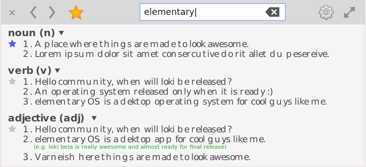

# Chapter Three: Coding Your Application (Tutorials)

```
* Creating and structuring a project
* Diving into Vala and GTK+
* Using the Granite extension
* Using the cmake build system
* Developing sample applications
```

In this chapter, we will take a look at how to create and structure a project for an elementary OS application. We will also dive into some Vala and GTK+ demonstrations to learn the process involved in development. Moreover, we will take advantage of the Granite extension which provides some well designed re-usable widgets and APIs to make application development quick and easy. Finally, we will use the [cmake build system](http://www.cmake.org/) to build and install demonstrated applications (along with icons and configuration files) for testing in your development environment.

After learning all those above, you will then learn to use those acquired skills to build few sample applications. This will demonstrate some real-world elementary OS application development challenges and how to get around them. In the course of learning, you will be introduced to Object Oriented Programming patterns, some Vala tips and tricks among others.

## Creating and structuring an application project
An project is combination of source files, configuration files and graphics, structured logically to make development manageable and easy. You may create your project in any directory (folder) you want, but I usually place mine at `workspace/vala/` in my Home directory. Whilst in the `workspace/vala/` directory (or wherever you create your project), create a director named `demo-app` which will be the root directory of the project. The basic structure of project is as below;

```sh
demo-app/
        src/
            main.vala    
```

As you can see, the `demo-app` directory has a sub-directory, `src`, which contains a single file named `main.vala`. Inside the `src` directory is where all Vala source files will be placed. This is the most basic structure a project could have. We will add more sub-directories and files to the project as we expand our basic application. The `main.vala` file will contain the initial code of the application which will serve as entry point.

Now that we have the project structure setup, it is time to install the development libraries as provided in the official elementary OS [Getting Started Tutorial](https://elementary.io/docs/code/getting-started#development-libraries). You can install the development libraries in your terminal using `sudo apt-get build-dep granite-demo`. As indicated in [Chapter One](chapter_01.md), there a several development tools available for development. I will be working on elementary OS 0.4 Loki, using Scratch (the default text editor) and Terminal —  all are pre-installed.

## Diving into Vala and GTK+

### A basic GTK+ demo
Finally, it is time to write some Vala and GTK+ code. Open the `demo-app` project in Scratch, and write the following basic vala code in `main.vala` <sup>*</sup>.

```vala
int main (string[] args) {
    stdout.printf ("Hello, World!\n");
    return 0;
}
```

The code above is a simple vala program made up of the `main` function, the entry point of every Vala program, which contains code which prints `Hello, World` to the screen and returns `0` —  `0` informs the  Operating System of a successful execution without any errors. 

To compile this program, navigate to the project root, in my case `~/workspace/vala/demo-app`, in Terminal and enter the command `valac src/main.vala` which will compile the code using the Vala compiler. You can now test the program using the command `./main` <sup>#</sup>.

> \* The coding convention used in this guide is based on the [elementary OS  reference guide](https://elementary.io/docs/code/reference).

> \# As I indicated earlier in the [introduction](README.md), the guide is not meant to teach you Vala and GTK+ programming. It is assumed you already have a basic knowledge and understanding of the above. We will be making more use of the command-line henceforth to compile our code as we continue to add more functionality. When you encounter an error when compiling or running the program, please double-check to make sure you typed everything correctly.
 
Now that we have been able to compile and run a basic Vala program, we are now ready to write a GTK+ program which will launch a window. Again open the `main.vala` file and replace its content with the following code;

```vala
int main (string[] args) {
    Gtk.init (ref args);

    var window = new Gtk.Window ();
    window.title = "Demo Application";
    window.window_position = Gtk.WindowPosition.CENTER;
    window.set_default_size (500, 300);
    window.destroy.connect (Gtk.main_quit);
    window.show_all (); // displays window and all its child widgets to the screen
 
    Gtk.main (); // Runs the GTK+ main event loop
    return 0;
}
```

The code above initializes GTK+ using `Gtk.init`, which accept the command line argument `args` as a `ref` parameter (see GTK+ reference at valadoc.org for detailed explanation of `Gtk.init`). We then create (instantiate) a GTK+ window, set the window title, the window position on the screen, and its default width and height. We then register the `Gtk.main_quit` function (method) to be executed when the user clicks the close button of the window.

To compile this program, we have to pass the GTK+ package (`gtk+-3.0`), as a command-line argument since we are now using the GTK+ GUI toolkit in the code. Enter the command `valac src/main.vala src/Application.vala --pkg=gtk+-3.0` to compile and run with `./main` as usual.


## Using the Granite extension
Granite is an extension to the GTK+ toolkit which provides extra widgets, APIs and CSS classes primarily customised for elementary OS application development. Granite makes development quick and easy by providing those above extensions which fit nicely into the elementary OS Human Interface Guidelines. Using Granite will save you time and effort from writing several components which are commonly used for application development.

The extensions provided by Granite include widgets such a an AboutDialog, DatePicker, AlertView, DynamicNotebook, Welcome, etc. APIs provided include Logger, DateTime, Color, SimpleCommand, etc. CSS style classes are also available to use saving you the effort of implementing your own GTK+ client-side decorations. You can check out the Granite documentation on [valadoc.org](http://valadoc.org) for more information.

### Using Granite `Application` class
Using `Gtk.init` and `Gtk.main` to initialize and run a GTK+ application works alright, but the `Granite.Application` class (a subclass of Gtk.Application) is a more convenient option. According to the GTK+ documentation;

>_"Currently, GtkApplication handles GTK+ initialization, application uniqueness, session management, provides some basic scriptability and desktop shell integration by exporting actions and menus and manages a list of toplevel windows whose life-cycle is automatically tied to the life-cycle of your application"_. See the GTK+ reference for further details.

The `Granite.Application` class adds more functionality on-top of Gtk.Application and it is the base class of all Granite-based applications. Therefore, it is _highly_ recommended to use it instead of `Gtk.Application.

To make the use of `Granite.Application` more practical, we will be creating a basic dictionary application called `Dictopia`. Building Dictopia will provide a real-world development experience. The wireframe and mock-up of Dictopia was already demonstrated in Chapter Two, so we will go ahead to the coding part. 

### Creating Dictopia dictionary application 



Dictopia is a very basic dictionary application with limited functionality which allows you to search hard-coded words in an array for definitions. Create a new project called `dictopia` with a `src` sub-directory which contains the usual `main.vala`.

#### Creating a Granite Application Window
At this point, we could write all the code in the `main.vala` file, but it is a good practice to write it in a  separate file. This style of coding introduces [Object Oriented Programming](https://chebizarro.gitbooks.io/the-vala-manual/content/en/object_oriented_programming.html) and is in-line with the elementary OS reference guide. Create a new file named `Application.vala` in the `src` directory and prefixed its content with the [GPL legal header](https://elementary.io/docs/code/reference#gpl-header) <sup>^</sup>. This declares that this code is backed by the GPL license. Make sure you replace the name, email address and website URL with your own information;

```txt
/* 
* Copyright (c) 2011-2016 Lawrence Aberba (https://github.com/aberba/)
*
* This program is free software; you can redistribute it and/or
* modify it under the terms of the GNU General Public
* License as published by the Free Software Foundation; either
* version 2 of the License, or (at your option) any later version.
*
* This program is distributed in the hope that it will be useful,
* but WITHOUT ANY WARRANTY; without even the implied warranty of
* MERCHANTABILITY or FITNESS FOR A PARTICULAR PURPOSE.  See the GNU
* General Public License for more details.
*
* You should have received a copy of the GNU General Public
* License along with this program; if not, write to the
* Free Software Foundation, Inc., 59 Temple Place - Suite 330,
* Boston, MA 02111-1307, USA.
*
* Authored by: Lawrence Aberba <karabutaworld@gmail.com>
*/
```


> ^ Usually, a source code has a legal backing which states the author and the legal restrictions placed on the usage of the source code. There are several [licensing options](https://en.wikipedia.org/wiki/Software_license) available and you are free to choose any for your code. I however, will use the [GPL license](https://www.gnu.org/licenses/) for all source code in this guide. Henceforth, every Vala source file a create will be prefixed with the GPL legal header including the `main.vala` file.

After the license, you can then add the following code;

```vala
namespace Dictopia {

    class Application: Granite.Application {
        
        construct {
            /*
                You may also use;
                    ApplicationFlags.HANDLES_OPEN
                    ApplicationFlags.HANDLES_COMMAND_LINE;
            */
            flags |= ApplicationFlags.FLAGS_NONE;

            application_id      = "com.aberba.github.dictopia";
            program_name        = "Dictopia";
            exec_name           = "dictopia";

            build_version       = "0.1"; 
            app_years           = "2016";
            app_icon            = "application-default-icon"; //use the default fallback
            app_launcher        = ""; // we will set this later

            main_url            = "";
            bug_url             = "";
            help_url            = "";
            translate_url       = "";

            about_authors       = {"Lawrence Aberba <karabutaworld@gmail.com>"};
            about_documenters   = {"Lawrence Aberba <karabutaworld@gmail.com>"};
            about_artists       = {"Lawrence Aberba <karabutaworld@gmail.com>"};
            about_comments      = "A simple dictionary application";
            about_translators   = "translator-credits";
            about_license_type  = Gtk.License.GPL_3_0;
        }

        public override void activate () {
            var window = new Gtk.ApplicationWindow (this);
            window.title = "Dictopia";
            window.window_position = Gtk.WindowPosition.CENTER;
            window.set_default_size (500, 300);
            
            window.show_all ();
        }
    }
}
```

In the above code we make use of some Object Oriented Programming features of Vala including classes and the [namespace](https://chebizarro.gitbooks.io/the-vala-manual/content/en/namespaces.html) construct to scope blocks of code. The Dictopia code is exposed with the `Dictopia` namespace within which all code are encapsulated.

The `Dictopia.Application` class uses the GObject-Style construction as opposed to the Java or C# style of construction — Vala supports both. Within the `construct` constructor block we initialize the _so-called_ construct properties of `Granite.Application` such as application_id, program_name, build_version, license type, etc., as well as, other customizations: application and developers information (see Granite documentation on [valadoc.org](http://valadoc.org)). In `flags |= ApplicationFlags.FLAGS_NONE;` code appends the flag using `|=` without setting it as the only argument to `flags`. The `Granite.Application` requires that you set the `application_id` property. A traditional way is to do com/net/org (dot) your companies name (dot) your application name (all in lower-case). In my case, I chose to use `com.aberba.github.dictopia` as my unique application ID to reflect my Github repository where a plan to host the application when completed. This pattern is recommended to make the unique ID compatible with _Houston__. Supposing I create another application called __Downloader__, its unique ID will be `com.aberba.github.downloader`.         

Within the `activate` method is where you would activate your application: initial window building, define startup functions, plugin loading, loading configurations, etc. Inside the activate method is where we will place almost all our application logic among others. The `activate` method in `Dictopia.Application` is defined by _overriding_ the the `activate` method of `Granite.Application` which is the superclass. In this case, I initialized a new `Gtk.AplicationWindow` and band it to `Dictopia.Application` by passing it as the `this` argument — `this` references `Dictopia.Application`. The `Gtk.ApplicationWindow` class is described in the GTK+ documentation as below;

> _"GtkApplicationWindow is a Window subclass that offers some extra functionality for better integration with Application features. Notably, it can handle both the application menu as well as the menubar"_. See the GTK+ reference for further details.

Since Gtk.ApplicationWindow is a subclass of Gtk.Window, we then set its basic properties such as title, window position, width and height. Again we are using the Granite package which we have to pass it as a command-line argument to compile the code successfully. Enter the command `valac src/main.vala src/Application.vala --pkg=gtk+-3.0 --pkg=granite` to compile and `./main`. Below is a screenshot of the new program;


As you can see, the new window is almost like the previous version except that the Window title is now `Dictopia`. However, the program is now using Granite.Application which setup provides more functionally we can utilize to extend the application even further. The above code does not seet some parameters such as app_launcher, main_url, bug_url, etc. which we will set owns we host our application on _Github_.

#### Adding a Headerbar Widget.
Dictopia uses a header bar which contains a forward and back button, a bookmark button, a search entry, and an application menu.

  

All widget source files will be placed in the a ` Widgets` subdirectory within the `src` directory. Using the `Gtk.HeaderBar` widget, we will create a custom titlebar and use it in the application window in-place of the default window bar. To do this create a separate file named `HeaderBar.vala` in the `src/Widgets` directory and write the following code after inserting a legal header;

```vala
// HeaderBar.vala

namespace Dictopia {

    class Widgets.HeaderBar: Gtk.HeaderBar {
        public HeaderBar () {
            this.title = "Dictopia";
            this.show_close_button = true;
        }
    }
}
```

We can now use the new HeaderBar widget in the `execute` method of Dictopia.application like below;

```vala
 /*
* This is our function to "activate" the GTK App. 
* All application logic goes here.
*/
public override void activate () {
    var window = new Gtk.ApplicationWindow (this);
    //window.title = "Dictopia";
    window.window_position = Gtk.WindowPosition.CENTER;
    window.set_default_size (400, 200);

    var header_bar = new Widgets.HeaderBar();
    window.set_titlebar (header_bar);
    
    window.show_all ();
}
```

Because we are now using a HeaderBar, there is no need to set a window title instead the HeaderBars title is used. We have also added a `HeaderBar.vala` file to the project, so we need to include it in the command for compiling the code. Enter `valac src/main.vala src/Application.vala src/Widgets/HeaderBar.vala --pkg=gtk+-3.0 --pkg=granite
` to compile the code and then run the program. The new window should look similar to the screenshot below;


At this point, the window creation code is code located in the `execute` method in the `Application.vala` file, which is not a good Object Oriented Programming practice. Create a separate `Window.vala` file in the `src` directory and insert a new class which will contain the window creation code (make sure you prepend a legal header).

```vala
// Window.vala

namespace Dictopia {

    class Window: Gtk.ApplicationWindow {
        private Gtk.HeaderBar header_bar;

        public Window (Gtk.Application application) {
            Object (application: application);
            this.window_position = Gtk.WindowPosition.CENTER;
            this.set_default_size (500, 200);

            this.build_ui ();
        }

        void build_ui () {
            header_bar = new Dictopia.Widgets.HeaderBar();
            this.set_titlebar (header_bar);
        }
    }
}
```

As you can see, the `Dictopia.Window` constructor expects a `Gtk.Application` argument which is a requirement of `Gtk.ApplicationWindow`. The class has a `build_ui` method which is called within the class constructor to initialize widgets placed within the window. From this point onwards, we will create all other widgets of our application within the `build_ui` method. The `header_bar` of widget is now declare as `private` to the `Dictopia.Window` class making it only accessible within the class. This is necessary since we will only use the `header_bar` object within the class which is a good Object Oriented Programming practice.

You must now include the `window.vala` file in the command to compile the code. We have not made any changes to the UI so the program will look exactly as it was, however we now have a clean code base.

##### Adding Widgets to the Headerbar
The headerbar of Dictopia contains widgets such as the forward and back buttons, the bookmarks buttons (star), a search entry and an application menu. Open the `HeaderBar.vala` file and add the code for those widgets;

```vala

namespace Dictopia {

    class Widgets.HeaderBar: Gtk.HeaderBar {
        Dictopia.Application app;

        private Granite.Widgets.ModeButton mode_button;
        private Gtk.Button bookmark_button;
        private Gtk.SearchEntry search_entry;
        private Granite.Widgets.AppMenu menu_button;


        public HeaderBar (Dictopia.Application app) {
            this.app = app;

            this.title = "Dictopia";
            this.show_close_button = true;
            
            this.build_ui ();
        }

        void build_ui () {
            // forward and back buttons 
            mode_button = new Granite.Widgets.ModeButton ();
            mode_button.append_icon ("go-previous", Gtk.IconSize.BUTTON);
            mode_button.append_icon ("go-next", Gtk.IconSize.BUTTON);
            this.pack_start (mode_button);

            // Bookmark button
            bookmark_button = new Gtk.Button.from_icon_name ("help-about");
            this.pack_start (bookmark_button);

            // Search entry
            search_entry = new Gtk.SearchEntry ();
            search_entry.placeholder_text = "Search Word or Phrase";
            this.pack_end (search_entry);

            // search_entry.activate.connect (() => {
            //  stdout.printf(search_entry.get_text ());
            // });
            
            // Application menu items
            var menu = new Gtk.Menu ();

            // Application menu gear button
            var menu_button = new Granite.Widgets.AppMenu.with_app (this.app, menu);
            this.pack_end (menu_button);
        }


    }
}
```